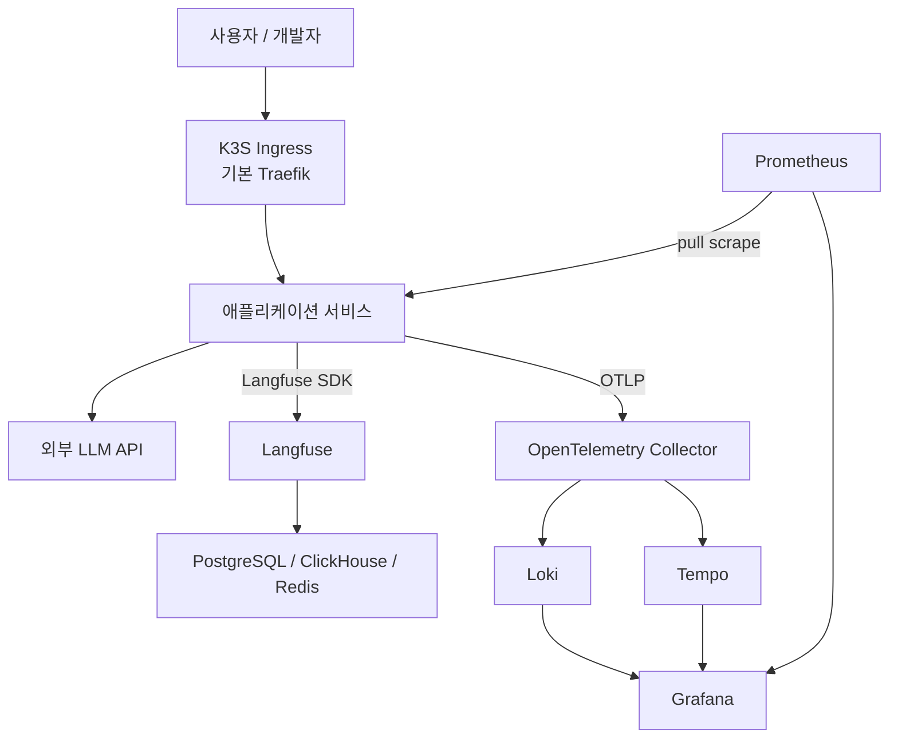
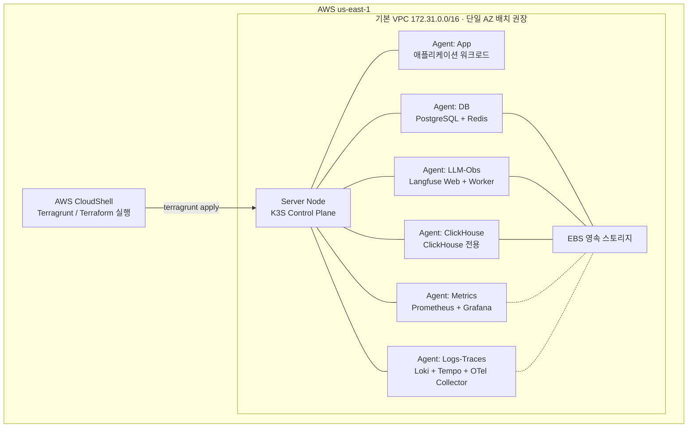
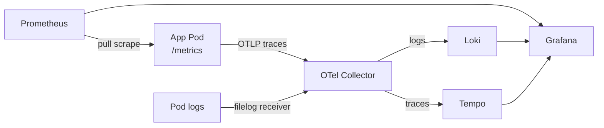
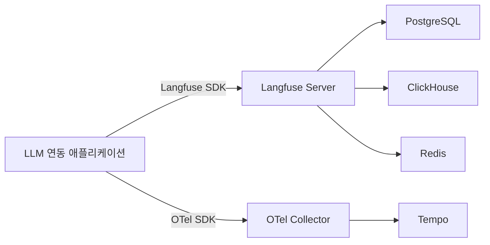
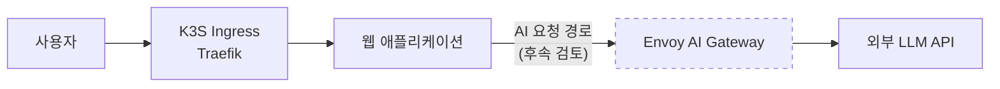
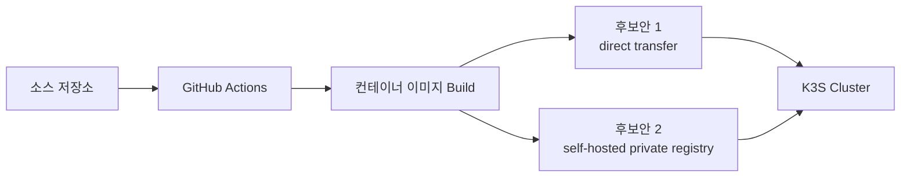

# 아키텍처 문서

- 문서 상태: Draft
- 작성일: 2026-04-03
- 최종 수정: 2026-04-03
- 기준 문서:
  - [PRD](./PRD.md)
  - [ADR-001](./adr/001-adopt-hybrid-telemetry-collection.md)
  - [ADR-005](./adr/005-adopt-langfuse-v3-storage-topology.md)
  - [ADR-006](./adr/006-adopt-k3s-seven-node-topology.md)
  - [ADR-004](./adr/004-standardize-on-grafana-for-visualization.md)
  - [네트워크 인벤토리](./network-inventory.md)
  - [Security Group 포트 매트릭스](./security-group-matrix.md)

## 1. 목적

이 문서는 현재까지 확정된 요구사항과 ADR을 기준으로 LLM 서비스 운영 환경의 상위 아키텍처를 정리한다.
아직 미결정인 사안은 별도 섹션으로 분리하며, 본문의 기본 다이어그램은 확정된 내용만 반영한다.

## 2. 아키텍처 원칙

- AWS 학습용 계정 제약 안에서 재현 가능한 구성을 유지한다.
- K3S 멀티 노드로 역할별 워크로드를 분리한다.
- 관측은 Metrics, Logs, Traces를 모두 수집하되 시각화는 Grafana로 통일한다.
- LLM 전용 관측은 Langfuse를 셀프 호스팅한다.
- 일반 웹 트래픽 진입점과 AI/LLM 제어 계층은 분리해서 사고한다.

## 3. 확정된 결정 요약

| 영역 | 확정 사항 | 근거 |
|------|-----------|------|
| 클러스터 토폴로지 | K3S 7노드 역할 분리 구조 채택 | ADR-006 |
| 텔레메트리 수집 | Metrics는 Prometheus 직접 scrape, Logs/Traces는 OTel Collector 경유 | ADR-001 |
| 시각화 | Grafana 단일 플랫폼 사용 | ADR-004 |
| LLM 관측 | Langfuse v3 셀프 호스팅 (PostgreSQL + ClickHouse + Redis) | ADR-005 |
| 배포 환경 | AWS `us-east-1`, CloudShell에서 Terragrunt/Terraform 실행 | PRD |
| 네트워크 | 기본 VPC/서브넷 사용, 외부 접근은 K3S ingress 기반 | PRD, [네트워크 인벤토리](./network-inventory.md) |

## 4. 시스템 컨텍스트

> 메트릭 수집은 Prometheus가 App의 `/metrics` 엔드포인트를 **pull 기반으로 scrape**하는 방식이다 (ADR-001).

## 5. 배포 아키텍처

### 5.1 인프라 및 클러스터

> 안 A를 최종 토폴로지로 채택한다. ClickHouse는 DB 노드와 분리된 전용 노드에 배치한다.

### 5.2 노드 역할

아래는 확정된 7노드 기준이다.

| 노드 역할 | 수량 | 주요 책임 | 비고 |
|-----------|------|-----------|------|
| Server | 1대 | K3S 컨트롤 플레인 (etcd, API Server, Scheduler) | 필수 |
| Agent: App | 2대 | 프론트엔드/백엔드 애플리케이션 배치 | 앱 워크로드 여유 확보 |
| Agent: Metrics | 1대 | Prometheus, Grafana | 메트릭 수집 및 시각화 전용 |
| Agent: Logs-Traces | 1대 | Loki, Tempo, OTel Collector | 로그/트레이스 수집 전용 |
| Agent: DB | 1대 | PostgreSQL, Redis | 저장소 계층 (App DB + Langfuse metadata 공용) |
| Agent: LLM-Obs | 1대 | Langfuse Web + Worker | LLM 관측 전용 |
| Agent: ClickHouse | 1대 | ClickHouse | 전용 노드로 분리 |

> 기존 5노드 구상은 `t3.medium`(4GB) 제약에서 관측 스택과 저장소 계층의 메모리 경쟁이 커서 폐기했다. 현재 토폴로지 결정은 ADR-006이 기준이다.

### 5.3 노드별 리소스 예산

모든 노드는 `t3.medium`(2 vCPU, 4GB RAM)으로 제한된다. OS + kubelet 오버헤드로 ~300~500MB를 제외하면 워크로드 가용 메모리는 **~3.5GB**이다.

#### 확정안 (7대)

| 노드 역할 | 서비스 | 최소 메모리 | 가용 대비 | 판정 |
|-----------|--------|-----------|----------|------|
| Server | K3S CP (embedded etcd) | ~1.0~1.5GB | 여유 | ✅ |
| Agent: App | 애플리케이션 | ~0.8~2.0GB | 서비스 스택에 따라 다름 | ✅ |
| Agent: Metrics | Prometheus + Grafana | ~2.0~2.5GB | 빠듯하지만 가능 | 🟡 |
| Agent: Logs-Traces | Loki + Tempo + OTel | ~1.2~2.3GB | 여유 | ✅ |
| Agent: DB | PostgreSQL + Redis | ~0.5~0.8GB | 여유 | ✅ |
| Agent: ClickHouse | ClickHouse 전용 | ~2.0~3.5GB | 튜닝 필요 | 🟡 |
| Agent: LLM-Obs | Langfuse Web + Worker | ~1.3~2.5GB | 가능 | 🟡 |

#### 비교 메모

| 구성 | VM 수 | 월 예상 비용 |
|------|------|-------------|
| 확정안 A | 7대 | ~$190~225/월 |
| 검토 후 제외된 안 B | 6대 | ~$160~195/월 |
| ~~기존 5대~~ | ~~5대~~ | ~~$130~165/월~~ |

> 비용은 증가하지만, ClickHouse와 관측 스택을 분리해 OOM 위험을 낮추는 쪽을 우선한다.

## 6. 관측 아키텍처

### 6.1 텔레메트리 수집 경로

> OTel Collector 배포 방식(DaemonSet(로그) + Deployment(트레이스) 조합)은 Phase 4에서 결정한다 (ADR-001 참조).

### 6.2 관측 컴포넌트 책임

| 컴포넌트 | 책임 |
|----------|------|
| Prometheus | Pull 기반 메트릭 수집 및 저장 |
| OpenTelemetry Collector | 로그/트레이스 수집, 처리, 백엔드 전달 |
| Loki | 로그 저장 및 조회 |
| Tempo | 분산 트레이스 저장 및 조회 |
| Grafana | 메트릭/로그/트레이스 통합 시각화 |

### 6.3 알림 (Alerting)

- 기본 알림 규칙을 구성한다 (노드 다운, Pod CrashLoopBackOff, 디스크 부족 등).
- 알림은 Grafana Alerting 또는 Alertmanager를 통해 처리한다.
- 알림 수신 채널(Slack, Email 등)은 Phase 4에서 결정한다.

## 7. LLM 관측 아키텍처

### 설명

- Langfuse는 애플리케이션의 LLM 호출 추적, 프롬프트 관리, 비용 추적을 담당한다.
- 인프라 및 애플리케이션 트레이스는 OTel Collector를 통해 Tempo로 집계된다.
- LLM 관측과 일반 텔레메트리는 목적이 다르므로 저장소와 조회 경로를 분리해서 본다.
- 인프라 트레이스(OTel → Tempo)와 LLM 트레이스(SDK → Langfuse) 간 `trace_id` 기반 correlation은 Phase 7에서 검토한다.

## 8. AI Gateway 계층 (후속 검토)

> 이 섹션은 확정된 결정이 아니라 검토 방향을 기록한 것이다.

- Envoy AI Gateway는 일반 ingress 대체재가 아니라 **AI/LLM 요청 제어 계층**으로 검토한다.
- 기존 K3S Traefik ingress는 일반 웹 트래픽 진입점으로 유지한다.
- 이번 단계에서는 도입하지 않으며, Phase 6에서 문서화 중심으로 검토한다.

## 9. 배포 및 전달 경로

현재 문서 기준으로 확정된 배포 원칙은 다음 수준까지다.

- 애플리케이션은 컨테이너 이미지 기준으로 배포한다.
- 소스 변경 이후 자동 build 및 deploy가 가능한 기본 경로를 마련한다.
- GitHub Actions 사용은 가능하다.
- Public registry 업로드 방식은 사용하지 않는다.
- 초기 direct transfer 방식과 목표 private registry 방식이 모두 후보로 남아 있다.

따라서 현재 시점에는 아래처럼 "확정된 목표와 후보안" 수준으로만 표현한다.

## 10. 보안 및 접근 경계

### 10.1 확정된 보안 원칙

- EC2 SSH 접근은 Key Pair 기반으로 제한한다.
- K3S API Server 접근은 kubeconfig 기반으로 제어한다.
- Grafana, Langfuse 등 웹 UI는 기본 인증(ID/PW)을 설정한다.
- 민감 정보(DB 비밀번호, API 키 등)는 Kubernetes Secret으로 관리한다.
- Security Group은 노드 간 통신 포트와 외부 접근 포트를 최소 허용한다.

### 10.2 미결정 보안 항목

아래 항목은 Phase 2~3에서 확정한다.

- SSH 접근 방식: 직접 접근 vs Bastion 구성
- Security Group 포트 매트릭스 상세 (SSH, K3S API, Ingress, kubelet, VXLAN 등)
- GitHub Actions에서 VPC 내 EC2 접근 방식 (퍼블릭 IP 직접 접근 vs Self-hosted runner)
- 로컬 개발 환경에서 클러스터 접근 방식 (kubeconfig 배포, SSH 터널 등)

> 상세 포트 설계 초안은 [Security Group 포트 매트릭스](./security-group-matrix.md)에 정리한다.

## 11. 데이터 영속성 및 백업

### 11.1 영속 스토리지

- DB 노드(PostgreSQL, Redis), ClickHouse 노드, LLM-Obs 노드(Langfuse)는 EBS 볼륨을 사용하여 데이터를 영속 저장한다.
- Metrics 노드(Prometheus TSDB)와 Logs-Traces 노드(Loki chunks)의 영속 볼륨 전략은 미결정이다.
- EBS 볼륨 전략 상세(루트/데이터 분리 여부, DB 노드 용량, gp3 IOPS)는 Phase 2에서 확정한다.

### 11.2 백업 및 복구

- K3S Server 노드의 etcd 스냅샷 백업 주기 및 복원 절차를 Phase 3에서 정한다.
- Stateful 워크로드(PostgreSQL, ClickHouse, Prometheus TSDB, Loki chunks) 백업/복구 전략은 Phase 4~7에서 단계적으로 결정한다.
- 데이터 보존 정책(Retention)은 Prometheus, Loki, Tempo 각각에 대해 Phase 4에서 설정한다.

## 12. 미결정 사항

아래 항목은 PRD에 남아 있는 오픈 이슈이며, 본 문서의 기본 아키텍처에는 확정 사실로 반영하지 않는다.

### 블로커 (Phase 1 착수 전 확인)

- IAM 제한 범위 파악 — ⚠️ **네트워크 리소스(VPC/서브넷/라우팅/IGW) 수정 불가 확인됨** ([상세](./network-inventory.md#1-vpc-개요)). Security Group 생성/수정 권한은 미확인.
- Terraform state 영속화 방식 (S3 backend 가능 여부)
- EC2 동시 실행 vCPU limit 확인

### 설계 중 확정 필요

- 서비스 스택 최종 확정: `Next.js` 단독 vs `React + FastAPI`
- 도메인 및 TLS 적용 범위
- Langfuse 영속 볼륨 세부 전략
- Metrics/Logs-Traces 노드 영속 볼륨 전략 (Prometheus TSDB, Loki chunks)
- EBS 볼륨 전략 상세 (루트/데이터 분리 여부, gp3 IOPS)
- Grafana 대시보드 구성 범위 및 JSON Git 관리 방식
- Envoy AI Gateway 실제 도입 여부와 배치 시점
- GitHub Actions → VPC 내 EC2 접근 방식
- Self-hosted private registry 도입 시점 및 호스팅 위치
- Stateful 워크로드 백업/복구 전략
- Prometheus/Loki/Tempo 데이터 보존 정책 (Retention)
- 알림(Alerting) 수신 채널 (Slack, Email 등)
- OTel Collector 배포 방식 (DaemonSet vs Deployment 조합)
- PostgreSQL 공용 운영 시 App DB/Langfuse metadata 리소스 경쟁 허용 범위

## 13. 단계별 구현 관점

> Phase 번호는 [PRD](./PRD.md)와 동일한 체계를 따른다.

| PRD Phase | 목표 | 결과물 |
|-----------|------|--------|
| 1 | 착수 전 확인 (IAM, vCPU limit, 도메인 등) | 블로커 확인 문서 |
| 2 | AWS 인프라 프로비저닝 구조 마련 | Terraform/Terragrunt 실행 기반, 포트 매트릭스 |
| 3 | K3S 멀티 노드 클러스터 구성 | 서버 + 에이전트 토폴로지, etcd 백업 |
| 4 | 관측 스택 배포 | Prometheus, Loki, Tempo, Grafana, OTel Collector, 알림 |
| 5 | 애플리케이션 배포 기반 구성 | 자동 build/deploy 경로, 샘플 앱 배포 |
| 6 | AI Gateway 검토 | Envoy AI Gateway 검토 문서 |
| 7 | 앱 계측 및 LLM Observability | Langfuse 배포, 앱 계측 |
| 8 | 후속 고도화 | GitOps 확장, 배포 정책 고도화 |

> Phase 4와 Phase 5는 병렬 진행 가능하다.

## 14. 문서 해석 가이드

- 이 문서는 "지금까지 확정된 것"을 기록하는 기준선 문서다.
- 새 결정이 생기면 PRD 오픈 이슈를 갱신하고, 아키텍처에 영향을 주는 경우 새 ADR을 추가한다.
- Accepted ADR과 충돌하는 변경은 기존 문서 수정이 아니라 새 ADR로 대체한다.
- 점선(`.-.`)으로 표시된 다이어그램 요소는 미결정 사항이다.
- 본 문서에서는 7노드 토폴로지를 기준선으로 사용한다.
